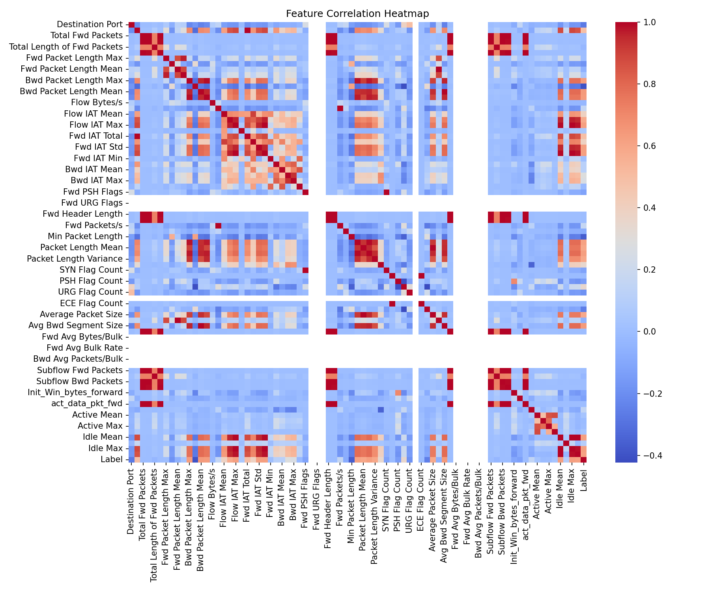
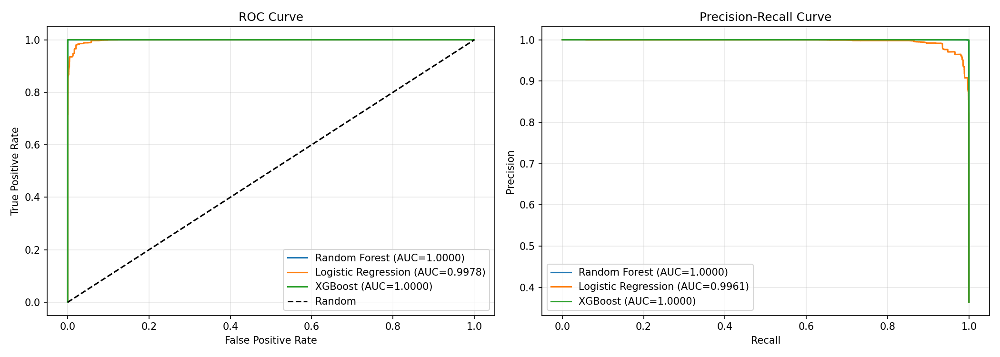
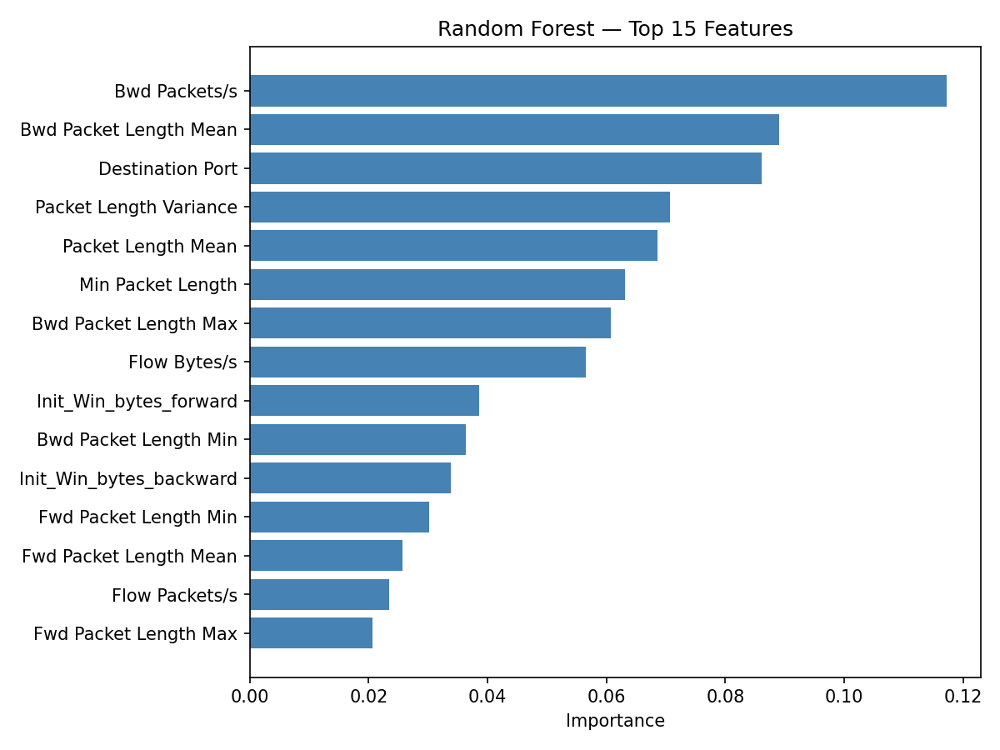
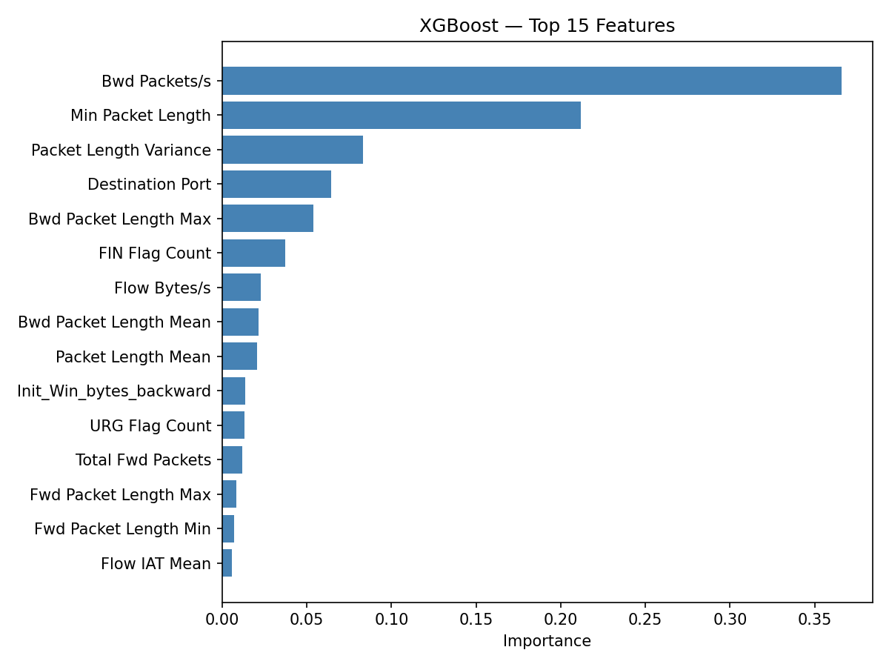
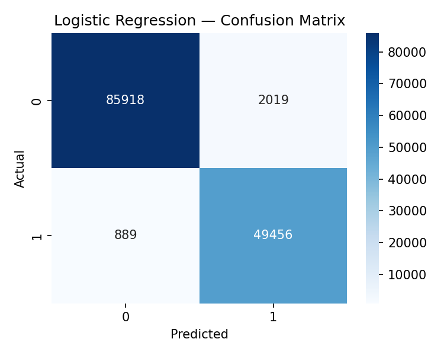

# DDoS Attack Detection

A machine learning project that detects DDoS attacks from network traffic flows using the CIC-IDS2017 dataset. Three models were trained and evaluated — XGBoost, Random Forest, and Logistic Regression — with XGBoost selected as the best performer.

---

## Results

| Model | F1 Score | Recall | Precision | Accuracy |
|---|---|---|---|---|
| XGBoost | 0.9997 | 0.9998 | 1.00 | 1.00 |
| Random Forest | 0.9992 | 1.0000 | 1.00 | 1.00 |
| Logistic Regression | 0.9716 | 0.9824 | 0.96 | 0.98 |

---

## Dataset

**CIC-IDS2017** — Canadian Institute for Cybersecurity  
Download: https://www.kaggle.com/datasets/kk0105/cicids2017  
Place `DDoS2.csv` inside the `data/` folder before running.

- 691,406 network flow records  
- 36.41% attack traffic, 63.59% benign  
- 80 raw features → 44 features after preprocessing  

---

## Project Structure
ddos-attack-detection/
├── data/                      # Place DDoS2.csv here (not included)
├── models/
│   ├── model_card.json        # Saved model metadata
│   ├── heatmap.png
│   ├── roc_pr_curves.png
│   ├── rf_importance.png
│   ├── xgb_importance.png
│   ├── Random_Forest_cm.png
│   ├── Logistic_Regression_cm.png
│   └── XGBoost_cm.png
├── ddos_detection.py          # Main training and evaluation script
├── requirements.txt           # Python dependencies
└── README.md

---

## How It Works

1. **Audit** — checks for data leakage and zero-variance features
2. **Split** — stratified 70% train / 10% validation / 20% test
3. **Preprocess** — drops 10 zero-variance columns, removes 24 highly correlated features, StandardScaler applied on train only
4. **Train** — XGBoost, Random Forest, Logistic Regression
5. **Threshold tuning** — optimal threshold selected on validation set only, test set never touched
6. **Evaluate** — final metrics reported on held-out test set
7. **Cross-validate** — Stratified K-Fold (5 splits), Mean F1: 0.9995 ± 0.0001

---

## Output Visualizations

### Feature Correlation Heatmap


### ROC and Precision-Recall Curves


### Feature Importance — Random Forest


### Feature Importance — XGBoost


### Confusion Matrices




---

## How To Run

**1. Clone the repo**
```bash
git clone https://github.com/shaha-72/ddos-attack-detection.git
cd ddos-attack-detection
```

**2. Install dependencies**
```bash
pip install -r requirements.txt
```

**3. Add the dataset**  
Download `DDoS2.csv` from the Kaggle link above and place it inside the `data/` folder.

**4. Update the file path**  
Open `ddos_detection.py` and find this line at the bottom:
```python
df = load_data(r"D:\DDOS Attack Detection\data\DDoS2.csv")
```
Change it to:
```python
df = load_data("data/DDoS2.csv")
```

**5. Run**
```bash
python ddos_detection.py
```

---

## Output Files

| File | Description |
|---|---|
| `models/heatmap.png` | Feature correlation heatmap |
| `models/roc_pr_curves.png` | ROC and Precision-Recall curves |
| `models/rf_importance.png` | Random Forest top 15 features |
| `models/xgb_importance.png` | XGBoost top 15 features |
| `models/Random_Forest_cm.png` | Random Forest confusion matrix |
| `models/Logistic_Regression_cm.png` | Logistic Regression confusion matrix |
| `models/XGBoost_cm.png` | XGBoost confusion matrix |
| `models/best_model.pkl` | Saved XGBoost model |
| `models/scaler.pkl` | Saved StandardScaler |
| `models/threshold.pkl` | Saved decision threshold (0.82) |
| `models/feature_names.pkl` | Saved feature names used in training |
| `models/model_card.json` | Model metadata and performance summary |

---

## Validation

- No data leakage detected across all features
- Threshold tuned on validation set — test set never touched during training or tuning
- Stratified splits ensure consistent class ratio (36.41%) across train, val, and test
- Cross-validation Std: 0.0001 — confirms model is stable and generalizes well

---

## Why Is Accuracy So High?

CIC-IDS2017 is a lab-generated dataset captured in a controlled environment using real attack tools (LOIC, HOIC). Attack traffic in controlled lab conditions is extremely stereotyped — near-zero idle time, uniform packet inter-arrival intervals — making it highly separable from benign traffic. This is consistent with published research on this dataset where tree-based models routinely achieve 99%+ accuracy.

---

## Tech Stack

- Python 3.x
- scikit-learn
- XGBoost
- pandas
- numpy
- matplotlib
- seaborn
- joblib

---

## Note

This model was trained on lab-generated traffic from a controlled environment. Performance may differ on real-world production network data. Revalidation on live traffic is recommended before any production deployment.

---

## Author

Made by Shahayusuf 
For questions or suggestions, open an issue on this repository.
